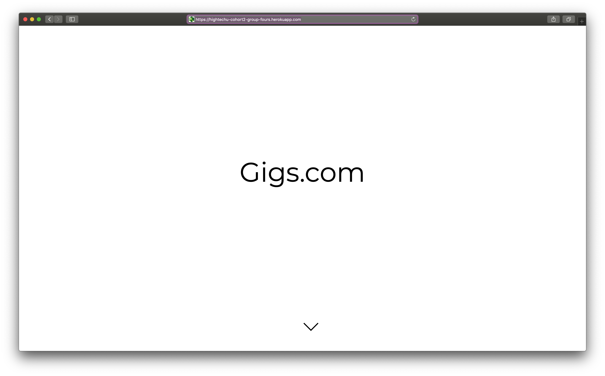
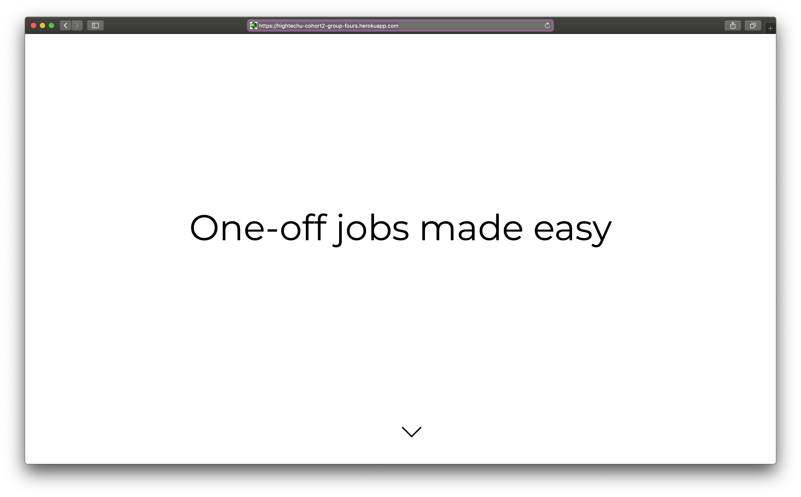
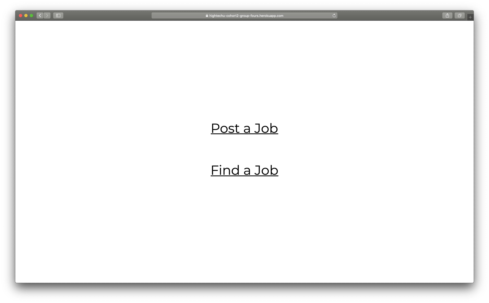
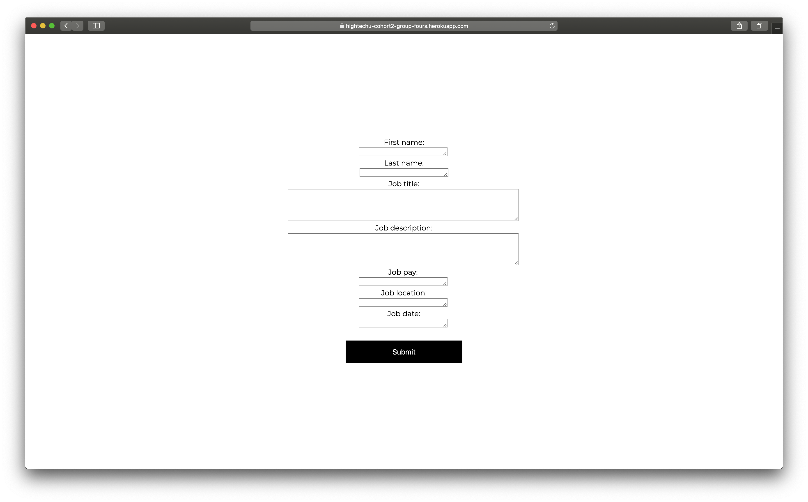
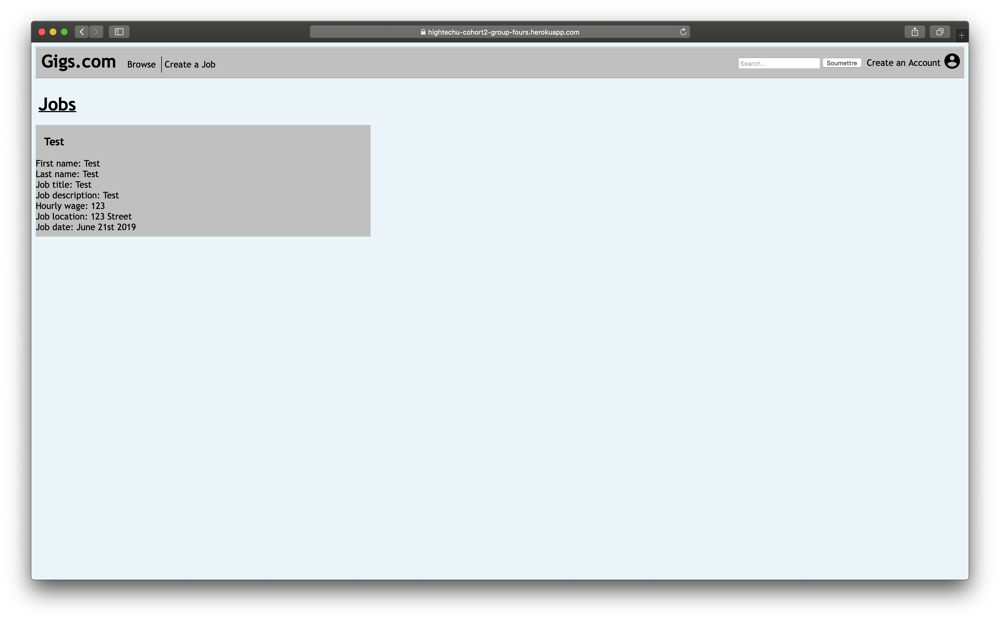

# Gigs

**2019 HighTechU Academy - Cohort 2**

## Website

https://hightechu-cohort2-group-fours.herokuapp.com

## Mini Pitch

Easy 1 off non-committed jobs if you want to make quick money randomly as a seeker and to be able to create job listings easily as a submitter.

## Problem Statment

It can sometimes be a challenge to find ways to make some money when you're a teenager or just young in general, so this Odds Jobs Board can help youth find jobs that suit their needs.

## User Stories

* As a submitter, I want to be able to view the users offering to complete my jiob so that I can contact the user I desire.
* As a seeker, being able to find a job that fits their specific needs and specifications such as location, price and relevance to me.
* As a seeker, i want a website that represents my skills and expertise so I have a better chance of getting jobs.
* As a user, I want a clean landing page so I can easily access all portions of the website.
* As a submitter, I want a form to fill so i can unput the details of my gig listing.
* As a seeker, I want to be bale t oquickly get non-committed jobs and get full information for that job.
* As a user, I want to be able to make a profile so the user can easily apply/offer jobs.

## Website Pages

* Landing page: index.html
* User Submissions Page: UserSubmissions.html
* Job Browsing Page: JobBrowsing.html
* User Profile Page: UserProfile.html
* Listing Form Page: ListingForm.html
* Job Details Page: JobDetails.html
* Account/Signup Page: SignUp.html

## Promo

## Made with:

* HTML
* CSS
* JS
* Loopback

## Made by:

* Cayden
* Devon
* Luke
* Ruben
